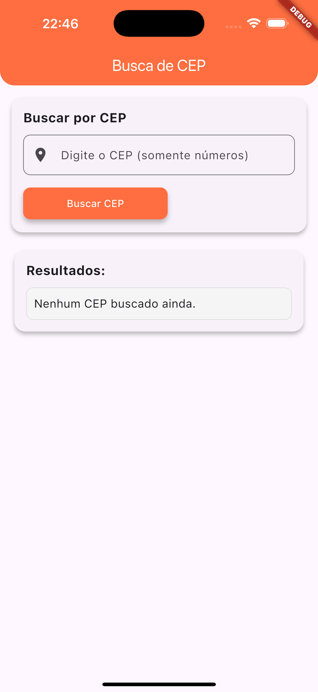
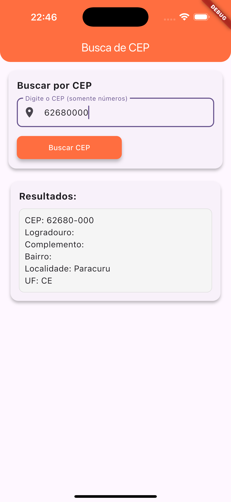

Busca de CEP
Um aplicativo Flutter simples e intuitivo para buscar informações de CEP (Código de Endereçamento Postal) no Brasil. Permite buscar tanto por um CEP específico quanto por nome de cidade e estado.

Funcionalidades
Busca por CEP: Insira um CEP de 8 dígitos e obtenha o endereço completo (logradouro, complemento, bairro, localidade, UF).

Busca por Cidade/Estado: Pesquise CEPs por nome de cidade e sigla do estado, exibindo uma lista dos primeiros resultados encontrados.

Interface Amigável: Design limpo e fácil de usar, com campos de entrada claros e exibição organizada dos resultados.

Indicador de Carregamento: Feedback visual durante as operações de busca.

Tratamento de Erros: Mensagens informativas para CEPs inválidos, erros de conexão ou resultados não encontrados.

Screenshots
Tela Inicial (Busca por CEP)

Tela de Resultado (Exemplo de Busca)

Resultado da Busca por CEP

Tecnologias Utilizadas
Flutter: Framework para desenvolvimento de aplicativos multiplataforma.

Dart: Linguagem de programação.

HTTP: Para realizar requisições à API externa.

ViaCEP API: API pública utilizada para obter os dados de CEP.

Como Executar o Projeto
Para rodar este projeto em sua máquina local, siga os passos abaixo:

Pré-requisitos
Certifique-se de ter o Flutter SDK instalado e configurado em seu ambiente de desenvolvimento. Você pode encontrar as instruções de instalação aqui.

Instalação
Clone o repositório:

git clone [URL_DO_SEU_REPOSITORIO]
cd [NOME_DA_PASTA_DO_PROJETO]

Instale as dependências:

flutter pub get

Execução
Conecte um dispositivo ou inicie um emulador:

flutter devices

Execute o aplicativo:

flutter run

Contribuição
Contribuições são bem-vindas! Sinta-se à vontade para abrir issues ou pull requests para melhorias, novas funcionalidades ou correção de bugs.

Licença
Este projeto está licenciado sob a Licença MIT.
